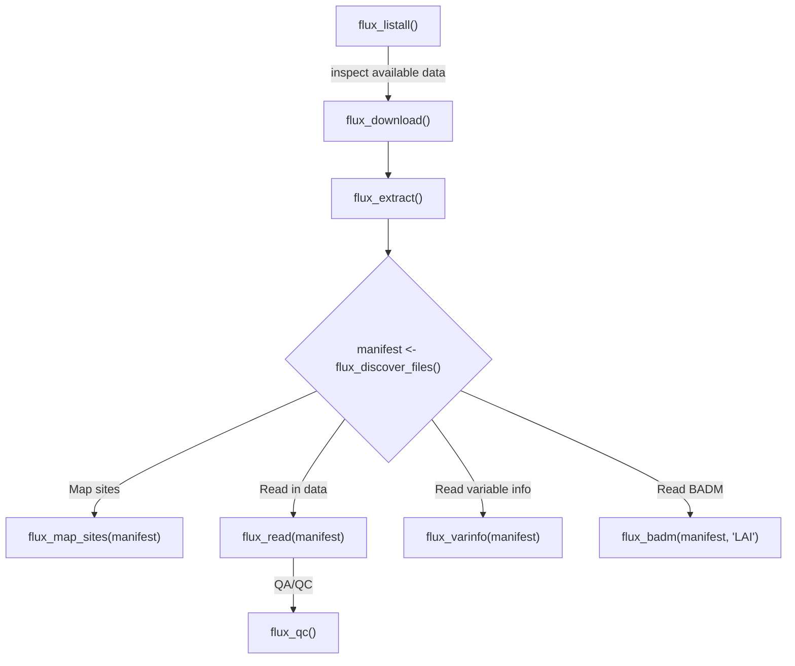

# fluxnet

<!-- badges: start -->
[](https://www.repostatus.org/#wip)
[](https://github.com/EcosystemEcologyLab/fluxnet-package/actions/workflows/R-CMD-check.yaml)
[](https://doi.org/10.5281/zenodo.19210221)
<!-- badges: end -->

`fluxnet` is an R package that provides utilities to download [FLUXNET](https://fluxnet.org) data from member networks, read in those data, perform basic quality control checks, and create exploratory visualizations and data inventories.

## Installation

You can install the development version of fluxnet from [GitHub](https://github.com/) with:

``` r
# install.packages("pak")
pak::pak("EcosystemEcologyLab/fluxnet-package")
```

This package also requires the `fluxnet-shuttle` Python library, but it will be installed automatically the first time you run `flux_listall()` or `flux_download()`.
You can, however, manage its installation with `flux_install_shuttle()` if you'd like!

## Data Use Requirements

The FLUXNET data are shared under a CC-BY-4.0 data use license which requires attribution for each data use. You can see the citations for each site in the result of `flux_listall()` and view the license document contained within each FLUXNET data product (downloaded zip files).

Please also cite the `fluxnet` package:

## Typical usage
<!-- FIXME: this works on GitHub, but not on the pkgdown site -->


## Updating/reinstalling fluxnet-shuttle

To force the `fluxnet` R package to re-install the `fluxnet-shuttle` utility, you can run `flux_install_shuttle()` with `reinitialize = TRUE`.
