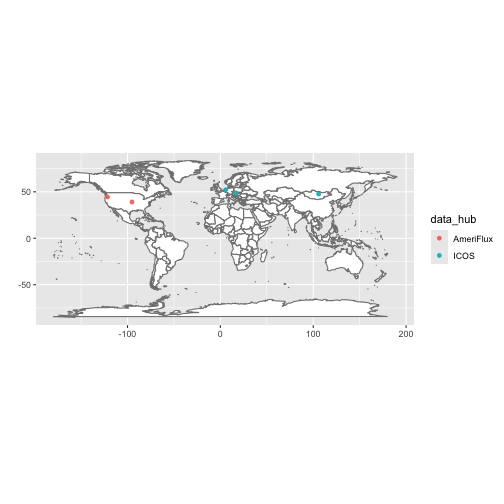

<!-- fluxnet.Rmd is generated by fluxnet.Rmd.source. Please edit fluxnet.Rmd.source and re-run precompute-vignettes.R to update this vignette! -->


``` r
library(fluxnet)
#> ! Use of data downloaded by fluxnet requires you abide by FLUXNET data policies: <]8;;https://fluxnet.org/data/data-policy/https://fluxnet.org/data/data-policy/]8;;>
#> ℹ Citations for individual sites' datasets are returned by `]8;;x-r-help:fluxnet::flux_citationsfluxnet::flux_citations]8;;()`
library(dplyr)
#> 
#> Attaching package: 'dplyr'
#> 
#> The following objects are masked from 'package:stats':
#> 
#>     filter, lag
#> 
#> The following objects are masked from 'package:base':
#> 
#>     intersect, setdiff, setequal, union
```

## Discovering what is available for download

`flux_listall()` is an R wrapper around a command line program, [`fluxnet-shuttle`](https://github.com/fluxnet/shuttle), which requires Python.
The first time you run `flux_listall()`, a Python virtual environment will be created and `fluxnet-shuttle` will be installed into it.
If you don't have an appropriate version of Python installed, you may be prompted with tips on how to install it.


``` r
list <- flux_listall()
```


```
#> virtualenv: fluxnet
#> File list is expired, downloading the latest version
```

By default, the results of `flux_listall()` are saved in a user cache, so when you run it again it'll pull the results from there unless they are older than `cach_age`.  To ignore the cache, use `use_cache = FALSE`.  To *invalidate* the cache (and replace it with an updated one), use `cache_age = -Inf`.


``` r
# Don't use cached results:
list <- flux_listall(use_cache = FALSE)

# Invalidate and replace cached results:
list <- flux_listall(cache_age = -Inf)
```


The list returned by `flux_listall()` contains metadata on the available sites including, importantly, citations for site-level data attribution which is required by FLUXNET.


``` r
colnames(list)
#>  [1] "data_hub"               "site_id"                "site_name"              "location_lat"           "location_long"         
#>  [6] "igbp"                   "network"                "team_member_name"       "team_member_role"       "team_member_email"     
#> [11] "first_year"             "last_year"              "download_link"          "fluxnet_product_name"   "product_citation"      
#> [16] "product_id"             "oneflux_code_version"   "product_source_network"
list %>% select(site_id, product_citation)
#> # A tibble: 767 × 2
#>    site_id product_citation                                                                                                               
#>    <chr>   <chr>                                                                                                                          
#>  1 AR-Bal  Maria Isabel Gassmann, Natalia Edith Tonti (2026), AmeriFlux FLUXNET-1F AR-Bal Balcarce BA, Ver. v1.3_r1, AmeriFlux AMP, (Data…
#>  2 AR-CCa  Gabriela Posse (2026), AmeriFlux FLUXNET-1F AR-CCa Carlos Casares agriculture, Ver. v1.3_r1, AmeriFlux AMP, (Dataset). https:/…
#>  3 AR-CCg  Gabriela Posse (2025), AmeriFlux FLUXNET-1F AR-CCg Carlos Casares grassland, Ver. v1.3_r1, AmeriFlux AMP, (Dataset). https://d…
#>  4 AR-TF1  Lars Kutzbach (2025), AmeriFlux FLUXNET-1F AR-TF1 Rio Moat bog, Ver. v1.3_r1, AmeriFlux AMP, (Dataset). https://doi.org/10.171…
#>  5 AR-TF2  Lars Kutzbach (2025), AmeriFlux FLUXNET-1F AR-TF2 Rio Pipo bog, Ver. v1.3_r1, AmeriFlux AMP, (Dataset). https://doi.org/10.171…
#>  6 BR-CST  Antonio Antonino (2025), AmeriFlux FLUXNET-1F BR-CST Caatinga Serra Talhada, Ver. v1.3_r1, AmeriFlux AMP, (Dataset). https://d…
#>  7 BR-ITA  Joannès Guillemot (2026), AmeriFlux FLUXNET-1F BR-ITA MataFLUX: Multi-species tree restoration planting, Ver. v1.3_r1, AmeriFl…
#>  8 BR-Ji3  Alessandro Araujo (2026), AmeriFlux FLUXNET-1F BR-Ji3 Ji-Paraná/RO - Reserva Biológica do Jaru (RBJ), Ver. v1.3_r1, AmeriFlux …
#>  9 BR-Ma2  Alessandro Araujo, Celso von Randow, Antonio Manzi, Antonio Nobre, Gilberto Pastorello, Julie Andrews de França e Silva, Leila…
#> 10 BR-Ma3  Alessandro Araujo (2026), AmeriFlux FLUXNET-1F BR-Ma3 ZF3, Colosso farm, Ver. v1.3_r1, AmeriFlux AMP, (Dataset). https://doi.o…
#> # ℹ 757 more rows
```

## Downloading data

There are a few paths to downloading FLUXNET data.  If you just want to download everything available, simply run `flux_download()`.  You can download just specific sites with the `site_ids` argument, or you can filter the results of `flux_listall()` and pass those in.


``` r
# Download everything available.
flux_download()

# Download just certain sites
flux_download(site_ids = c("AR-CCg", "AR-TF1", "BR-CST"))

# Filter list and download
list_wet <- list %>% filter(igbp == "WET")
flux_download(file_list_df = list_wet)
```


```
#> Downloading data from all available sites.
```

## Extracting data from .zip files

`flux_extract()` allows you to unzip only desired files from all or some of the downloaded site .zip files.


``` r
# Extract everything (not recommended!)
flux_extract()

# Extract just annual and monthly data
flux_extract(resolutions = c("y", "m"))

# Extract hourly data for just certain sites
flux_extract(site_ids = c("AR-CCg", "AR-TF1"), resolutions = "h")

# Don't extract BIF and BIFVARINFO CSVs
flux_extract(extract_varinfo = FALSE)
```


## Discovering what data you have extracted

`flux_discover_files()` is used to create a "manifest" of the data available to read in.
You *must* create this manifest (and optionally filter it) to pass into `flux_read()`.


``` r
manifest <- flux_discover_files()
manifest
```


```
#> MM / ERA5 → 5 sites, 225 site-years across 5 files
#> MM / FLUXMET → 5 sites, 59 site-years across 5 files
#> YY / ERA5 → 5 sites, 225 site-years across 5 files
#> YY / FLUXMET → 5 sites, 59 site-years across 5 files
#> # A tibble: 35 × 23
#>    path                   product_source_network site_id dataset time_resolution first_year last_year oneflux_code_version release_version
#>    <fs::path>             <chr>                  <chr>   <chr>   <chr>                <int>     <int> <chr>                <chr>          
#>  1 …2015-2024_v1.3_r1.csv ICOS                   CZ-Lnz  BIF     <NA>                  2015      2024 v1.3                 r1             
#>  2 …2015-2024_v1.3_r1.csv ICOS                   CZ-Lnz  BIFVAR… MM                    2015      2024 v1.3                 r1             
#>  3 …2015-2024_v1.3_r1.csv ICOS                   CZ-Lnz  BIFVAR… YY                    2015      2024 v1.3                 r1             
#>  4 …1981-2025_v1.3_r1.csv ICOS                   CZ-Lnz  ERA5    MM                    1981      2025 v1.3                 r1             
#>  5 …1981-2025_v1.3_r1.csv ICOS                   CZ-Lnz  ERA5    YY                    1981      2025 v1.3                 r1             
#>  6 …2015-2024_v1.3_r1.csv ICOS                   CZ-Lnz  FLUXMET MM                    2015      2024 v1.3                 r1             
#>  7 …2015-2024_v1.3_r1.csv ICOS                   CZ-Lnz  FLUXMET YY                    2015      2024 v1.3                 r1             
#>  8 …2015-2020_v1.3_r1.csv JPF                    MN-Hst  BIF     <NA>                  2015      2020 v1.3                 r1             
#>  9 …2015-2020_v1.3_r1.csv JPF                    MN-Hst  BIFVAR… MM                    2015      2020 v1.3                 r1             
#> 10 …2015-2020_v1.3_r1.csv JPF                    MN-Hst  BIFVAR… YY                    2015      2020 v1.3                 r1             
#> # ℹ 25 more rows
#> # ℹ 14 more variables: download_time <dttm>, data_hub <chr>, site_name <chr>, location_lat <dbl>, location_long <dbl>, igbp <chr>,
#> #   network <chr>, team_member_name <chr>, team_member_role <chr>, team_member_email <chr>, download_link <chr>,
#> #   fluxnet_product_name <chr>, product_citation <chr>, product_id <chr>
```

You can visualize the sites you have data for with `flux_map_sites()`.


``` r
flux_map_sites(manifest)
```




## Reading in data

You can read in data by passing a manifest to `flux_read()`.
You can read in data for just select sites with the `site_ids` argument, but for more complex filtering you can simply subset the manifest object first.


``` r
# Read all available annual data
annual <- flux_read(manifest, resolution = "y")
#> Reading 10 files.
```


``` r
## NOT RUN ##
# Read in hourly data from specific sites
hourly <- flux_read(
  manifest,
  resolution = "h",
  site_ids = c("AR-CCg", "AR-TF1")
)

# Read in only ERA5 data
annual_era5 <- flux_read(manifest, resolution = "y", datasets = "ERA5")

# Filter manifest to just sites with "WET" for IGBP
n_wet_manifest <-
  left_join(manifest, list, by = join_by(site_id)) %>%
  filter(igbp == "WET", location_lat > 0)

n_wet_monthly <- flux_read(n_wet_manifest, resolution = "m")
```


## QC flagging

Fluxnet data can be gapfilled to varying degrees.
`flux_qc()` allows you to flag overly-gapfilled data using your choice of variables and gapfilling threshold(s).

### Example 1: Flag rows where `NEE_VUT_REF` is more than 30% gapfilled


``` r
flagged_nee <- flux_qc(annual, qc_vars = "NEE_VUT_REF", threshold = 0.3)
flagged_nee %>%
  filter(qc_flagged) %>%
  select(qc_flagged, p_gapfilled, NEE_VUT_REF_QC, everything())
#> # A tibble: 5 × 344
#>   qc_flagged p_gapfilled NEE_VUT_REF_QC site_id dataset time_resolution  YEAR TA_ERA TA_ERA_NIGHT TA_ERA_NIGHT_SD TA_ERA_DAY TA_ERA_DAY_SD
#>   <lgl>            <dbl>          <dbl> <chr>   <chr>   <chr>           <int>  <dbl>        <dbl>           <dbl>      <dbl>         <dbl>
#> 1 TRUE             0.412          0.588 NL-Loo  FLUXMET YY               2019   10.8         9.61            1.75       11.7          2.40
#> 2 TRUE             0.352          0.648 US-KFS  FLUXMET YY               2009   12.1        11.2             2.62       13.0          3.13
#> 3 TRUE             0.305          0.695 US-KFS  FLUXMET YY               2014   11.9        10.7             2.80       12.9          3.29
#> 4 TRUE             0.337          0.663 US-KFS  FLUXMET YY               2017   13.9        12.8             2.65       14.9          3.3 
#> 5 TRUE             0.419          0.581 US-KFS  FLUXMET YY               2019   12.6        11.7             2.51       13.4          3.05
#> # ℹ 332 more variables: SW_IN_ERA <dbl>, LW_IN_ERA <dbl>, VPD_ERA <dbl>, PA_ERA <dbl>, P_ERA <dbl>, WS_ERA <dbl>, TA_F_MDS <dbl>,
#> #   TA_F_MDS_QC <dbl>, TA_F_MDS_NIGHT <dbl>, TA_F_MDS_NIGHT_SD <dbl>, TA_F_MDS_NIGHT_QC <dbl>, TA_F_MDS_DAY <dbl>, TA_F_MDS_DAY_SD <dbl>,
#> #   TA_F_MDS_DAY_QC <dbl>, TA_F <dbl>, TA_F_QC <dbl>, TA_F_NIGHT <dbl>, TA_F_NIGHT_SD <dbl>, TA_F_NIGHT_QC <dbl>, TA_F_DAY <dbl>,
#> #   TA_F_DAY_SD <dbl>, TA_F_DAY_QC <dbl>, SW_IN_F_MDS <dbl>, SW_IN_F_MDS_QC <dbl>, SW_IN_F <dbl>, SW_IN_F_QC <dbl>, LW_IN_F_MDS <dbl>,
#> #   LW_IN_F_MDS_QC <dbl>, LW_IN_F <dbl>, LW_IN_F_QC <dbl>, LW_IN_JSB <dbl>, LW_IN_JSB_QC <dbl>, LW_IN_JSB_ERA <dbl>, LW_IN_JSB_F <dbl>,
#> #   LW_IN_JSB_F_QC <dbl>, VPD_F_MDS <dbl>, VPD_F_MDS_QC <dbl>, VPD_F <dbl>, VPD_F_QC <dbl>, PA_F <dbl>, PA_F_QC <dbl>, P_F <dbl>,
#> #   P_F_QC <dbl>, WS_F <dbl>, WS_F_QC <dbl>, USTAR <dbl>, USTAR_QC <dbl>, NETRAD <dbl>, NETRAD_QC <dbl>, PPFD_IN <dbl>, …
```

Notice that in this case `p_gapfilled` is just 1 - `NEE_VUT_REF_QC`.

### Example 2: Flag rows where NEE_VUT_REF *or* TA_F are more than 30% gapfilled


``` r
flagged_2 <- flux_qc(
  annual,
  qc_vars = c("NEE_VUT_REF", "TA_F"),
  threshold = 0.3
)
flagged_2 %>%
  filter(qc_flagged) %>%
  select(qc_flagged, p_gapfilled, NEE_VUT_REF_QC, TA_F_QC, everything())
#> # A tibble: 11 × 344
#>    qc_flagged p_gapfilled NEE_VUT_REF_QC TA_F_QC site_id dataset time_resolution  YEAR TA_ERA TA_ERA_NIGHT TA_ERA_NIGHT_SD TA_ERA_DAY
#>    <lgl>            <dbl>          <dbl>   <dbl> <chr>   <chr>   <chr>           <int>  <dbl>        <dbl>           <dbl>      <dbl>
#>  1 TRUE             0.345          0.946   0.655 CZ-Lnz  FLUXMET YY               2019  11.8        10.8              2.02      12.5 
#>  2 TRUE             0.378         NA       0.622 CZ-Lnz  FLUXMET YY               2022  11.5        10.4              2.01      12.3 
#>  3 TRUE             0.471         NA       0.529 MN-Hst  FLUXMET YY               2015   2.13        0.584            3.35       3.47
#>  4 TRUE             0.504          0.951   0.496 NL-Loo  FLUXMET YY               2004   9.93        8.81             1.70      10.7 
#>  5 TRUE             0.434          0.588   0.566 NL-Loo  FLUXMET YY               2019  10.8         9.61             1.75      11.7 
#>  6 TRUE             0.454         NA       0.546 US-KFS  FLUXMET YY               2007  13.3        12.3              2.59      14.2 
#>  7 TRUE             0.352          0.648   0.728 US-KFS  FLUXMET YY               2009  12.1        11.2              2.62      13.0 
#>  8 TRUE             0.305          0.695   0.836 US-KFS  FLUXMET YY               2014  11.9        10.7              2.80      12.9 
#>  9 TRUE             0.337          0.663   0.909 US-KFS  FLUXMET YY               2017  13.9        12.8              2.65      14.9 
#> 10 TRUE             0.419          0.581   0.920 US-KFS  FLUXMET YY               2019  12.6        11.7              2.51      13.4 
#> 11 TRUE             0.457         NA       0.543 US-Me7  FLUXMET YY               2022   7.84        6.27             2.89       9.10
#> # ℹ 332 more variables: TA_ERA_DAY_SD <dbl>, SW_IN_ERA <dbl>, LW_IN_ERA <dbl>, VPD_ERA <dbl>, PA_ERA <dbl>, P_ERA <dbl>, WS_ERA <dbl>,
#> #   TA_F_MDS <dbl>, TA_F_MDS_QC <dbl>, TA_F_MDS_NIGHT <dbl>, TA_F_MDS_NIGHT_SD <dbl>, TA_F_MDS_NIGHT_QC <dbl>, TA_F_MDS_DAY <dbl>,
#> #   TA_F_MDS_DAY_SD <dbl>, TA_F_MDS_DAY_QC <dbl>, TA_F <dbl>, TA_F_NIGHT <dbl>, TA_F_NIGHT_SD <dbl>, TA_F_NIGHT_QC <dbl>, TA_F_DAY <dbl>,
#> #   TA_F_DAY_SD <dbl>, TA_F_DAY_QC <dbl>, SW_IN_F_MDS <dbl>, SW_IN_F_MDS_QC <dbl>, SW_IN_F <dbl>, SW_IN_F_QC <dbl>, LW_IN_F_MDS <dbl>,
#> #   LW_IN_F_MDS_QC <dbl>, LW_IN_F <dbl>, LW_IN_F_QC <dbl>, LW_IN_JSB <dbl>, LW_IN_JSB_QC <dbl>, LW_IN_JSB_ERA <dbl>, LW_IN_JSB_F <dbl>,
#> #   LW_IN_JSB_F_QC <dbl>, VPD_F_MDS <dbl>, VPD_F_MDS_QC <dbl>, VPD_F <dbl>, VPD_F_QC <dbl>, PA_F <dbl>, PA_F_QC <dbl>, P_F <dbl>,
#> #   P_F_QC <dbl>, WS_F <dbl>, WS_F_QC <dbl>, USTAR <dbl>, USTAR_QC <dbl>, NETRAD <dbl>, NETRAD_QC <dbl>, PPFD_IN <dbl>, …
```

Now `p_gapfilled` is 1 - the smaller of `NEE_VUT_REF_QC` and `TA_F_QC`.

### Example 3: Flag rows where NEE_VUT_REF is more than 30% gapfilled *and* TA_F is more than 10% gapfilled


``` r
flagged_3 <- flux_qc(
  annual,
  qc_vars = c("NEE_VUT_REF", "TA_F"),
  threshold = c(0.3, 0.1),
  operator = "all"
)
flagged_3 %>%
  filter(qc_flagged) %>%
  select(qc_flagged, p_gapfilled, NEE_VUT_REF_QC, TA_F_QC, everything())
#> # A tibble: 3 × 344
#>   qc_flagged p_gapfilled NEE_VUT_REF_QC TA_F_QC site_id dataset time_resolution  YEAR TA_ERA TA_ERA_NIGHT TA_ERA_NIGHT_SD TA_ERA_DAY
#>   <lgl>            <dbl>          <dbl>   <dbl> <chr>   <chr>   <chr>           <int>  <dbl>        <dbl>           <dbl>      <dbl>
#> 1 TRUE             0.412          0.588   0.566 NL-Loo  FLUXMET YY               2019   10.8         9.61            1.75       11.7
#> 2 TRUE             0.272          0.648   0.728 US-KFS  FLUXMET YY               2009   12.1        11.2             2.62       13.0
#> 3 TRUE             0.164          0.695   0.836 US-KFS  FLUXMET YY               2014   11.9        10.7             2.80       12.9
#> # ℹ 332 more variables: TA_ERA_DAY_SD <dbl>, SW_IN_ERA <dbl>, LW_IN_ERA <dbl>, VPD_ERA <dbl>, PA_ERA <dbl>, P_ERA <dbl>, WS_ERA <dbl>,
#> #   TA_F_MDS <dbl>, TA_F_MDS_QC <dbl>, TA_F_MDS_NIGHT <dbl>, TA_F_MDS_NIGHT_SD <dbl>, TA_F_MDS_NIGHT_QC <dbl>, TA_F_MDS_DAY <dbl>,
#> #   TA_F_MDS_DAY_SD <dbl>, TA_F_MDS_DAY_QC <dbl>, TA_F <dbl>, TA_F_NIGHT <dbl>, TA_F_NIGHT_SD <dbl>, TA_F_NIGHT_QC <dbl>, TA_F_DAY <dbl>,
#> #   TA_F_DAY_SD <dbl>, TA_F_DAY_QC <dbl>, SW_IN_F_MDS <dbl>, SW_IN_F_MDS_QC <dbl>, SW_IN_F <dbl>, SW_IN_F_QC <dbl>, LW_IN_F_MDS <dbl>,
#> #   LW_IN_F_MDS_QC <dbl>, LW_IN_F <dbl>, LW_IN_F_QC <dbl>, LW_IN_JSB <dbl>, LW_IN_JSB_QC <dbl>, LW_IN_JSB_ERA <dbl>, LW_IN_JSB_F <dbl>,
#> #   LW_IN_JSB_F_QC <dbl>, VPD_F_MDS <dbl>, VPD_F_MDS_QC <dbl>, VPD_F <dbl>, VPD_F_QC <dbl>, PA_F <dbl>, PA_F_QC <dbl>, P_F <dbl>,
#> #   P_F_QC <dbl>, WS_F <dbl>, WS_F_QC <dbl>, USTAR <dbl>, USTAR_QC <dbl>, NETRAD <dbl>, NETRAD_QC <dbl>, PPFD_IN <dbl>, …
```

Because we've set `operator = "all"`, `p_gapfilled` is now 1 - the *larger* of `NEE_VUT_REF_QC` and `TA_F_QC` and all of the values are greater than the smaller of the `threshold` values.
